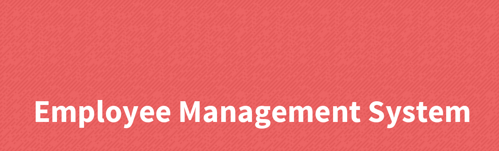

> A simple portal to manage all employee records.

## Project setup

### Local Dev Setup

1. Install **Sqlite3** and enable Sqlite3 in your **php.ini** file.
1. Verify **sqlite3 module** by running **php -m | grep sqlite**
1. Copy **.env.example** into **.env** file.
1. Make sure to update **DB_CONNECTION=sqlite**(default)
1. In order to make app work in local-machine, consider creating **database.sqlite** file in **database directory** in the 
root folder of the project.

### Install all dependencies
```
composer install
```

### Start server for development
```
php artisan serve
```
> If you need GUI representation, visit `app-url.com/~artisan`

### To run migrations and setup database
```
php artisan migrate
```

